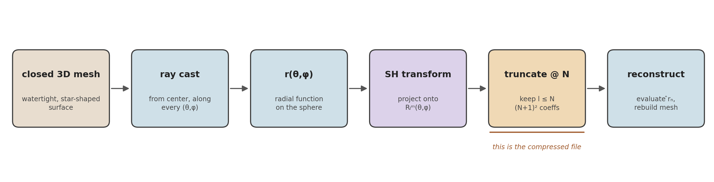
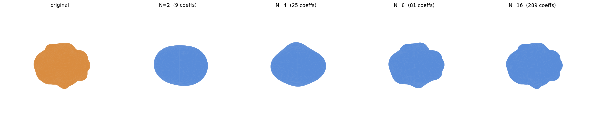
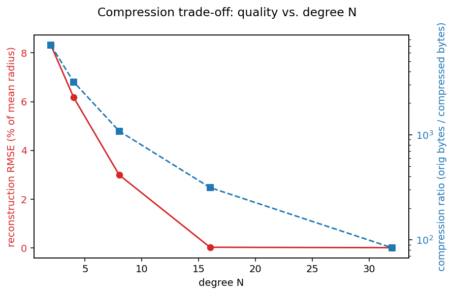
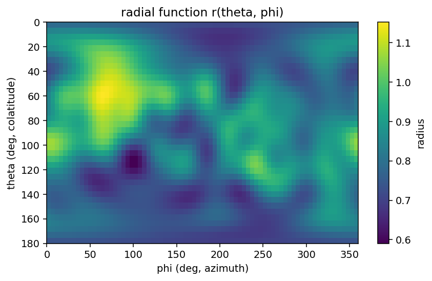

# Spherical-Harmonic 3D Shape Compressor

Compress a closed 3D surface mesh the way JPEG compresses an image — by
transforming it into a frequency basis and throwing away the high
frequencies. Here the "image" is the distance from a center point to the
surface, sampled over all directions, and the "frequency basis" is real
spherical harmonics.

```
mesh (V vertices, F faces)  --->  (N+1)² real numbers  --->  reconstructed mesh
```

<p align="center">
  
</p>

## Table of contents

- [The idea](#the-idea)
- [Math](#math)
  - [1. From a surface to a function on the sphere](#1-from-a-surface-to-a-function-on-the-sphere)
  - [2. Real spherical harmonics](#2-real-spherical-harmonics)
  - [3. Decomposition — the compression step](#3-decomposition--the-compression-step)
  - [4. Reconstruction — the decompression step](#4-reconstruction--the-decompression-step)
  - [5. Numerical integration](#5-numerical-integration)
- [Results](#results)
- [Installation](#installation)
- [Usage](#usage)
- [Limitations](#limitations)
- [Repo layout](#repo-layout)

## The idea

Take a closed, "star-shaped" mesh — one where every point on the surface is
visible in a straight line from some center point `c` (a sphere, a
potato, most organic blobs; **not** a torus, a mug, or anything
self-occluding). For every direction on the unit sphere, there's exactly
one point where a ray from `c` first exits the surface. That gives a
single scalar function of two angles:

$$
r(\theta,\phi) = \text{distance from } c \text{ to the surface in direction } (\theta,\phi)
$$

A 3D shape has become a 2D signal on the sphere. Spherical harmonics are
the sphere's version of a Fourier basis, so the same idea that
compresses audio (truncate a Fourier series) or images (truncate a
DCT/wavelet expansion) applies directly: expand $r$, keep the
low-degree terms, throw away the rest.

## Math

### 1. From a surface to a function on the sphere

Center the mesh at $c$ (its centroid by default). For a direction
```math
\hat n(\theta,\phi) = (\sin\theta\cos\phi,\ \sin\theta\sin\phi,\ \cos\theta), \qquad \theta\in[0,\pi],\ \phi\in[0,2\pi)
```

cast a ray $c + t\,\hat n(\theta,\phi),\ t>0$ and define

```math
r(\theta,\phi) = \min\{\, t > 0 : c + t\,\hat n(\theta,\phi) \in \partial M \,\}
```

i.e. the distance to the *closest* surface crossing along that ray. This
is exactly "the distance to the point on the model closest to the line
through the center and the sphere point": for a star-shaped mesh that
point lies exactly on the line (distance zero to the line itself), so its
distance to the center is $r(\theta,\phi)$.

### 2. Real spherical harmonics

$r(\theta,\phi)$ is a real number (a distance), so it's expanded in the
**real** orthonormal spherical-harmonic basis rather than the complex one
usually seen in textbooks:

```math
R_l^m(\theta,\phi) =
\begin{cases}
N_l^0\, P_l^0(\cos\theta), & m = 0 \\[6pt]
\sqrt{2}\,(-1)^m\, N_l^m\, P_l^m(\cos\theta)\, \cos(m\phi), & m > 0 \\[6pt]
\sqrt{2}\,(-1)^{|m|}\, N_l^{|m|}\, P_l^{|m|}(\cos\theta)\, \sin(|m|\phi), & m < 0
\end{cases}
```

where $P_l^m$ is the associated Legendre polynomial (Condon–Shortley phase
included) and

```math
N_l^m = \sqrt{\frac{2l+1}{4\pi}\,\frac{(l-m)!}{(l+m)!}}
```

is the normalization that makes the basis orthonormal on the sphere:

```math
\int_{S^2} R_l^m(\theta,\phi)\, R_{l'}^{m'}(\theta,\phi)\; d\Omega = \delta_{ll'}\,\delta_{mm'}, \qquad d\Omega = \sin\theta\; d\theta\, d\phi
```

The $\cos(m\phi)$ / $\sin(m\phi)$ factor *is* a real Fourier series in the
azimuth $\phi$; $P_l^m(\cos\theta)$ extends it smoothly over the polar
angle $\theta$. That's the precise sense in which this is "Fourier series
+ spherical harmonics." No complex numbers are needed anywhere: the
signal being compressed is real, so every coefficient below is real too
(the complex form $Y_l^m = P_l^m(\cos\theta)\,e^{im\phi}$ would give
complex $c_l^m$ satisfying $c_{l}^{-m} = (-1)^m\overline{c_l^m}$ for a real
signal — exactly twice as much redundant storage as the real basis
below).

### 3. Decomposition — the compression step

Project $r$ onto the basis:

```math
c_l^m = \int_{S^2} r(\theta,\phi)\, R_l^m(\theta,\phi)\; d\Omega
```

The full (lossless, in the band-limited sense) representation needs
infinitely many $l$. The **compressed representation** truncates at a
chosen degree $N$:

```math
\Big\{\, c_l^m \;:\; 0 \le l \le N,\ -l \le m \le l \,\Big\}, \qquad (N+1)^2 \text{ real numbers total}
```

That's the entire compression knob. Small $N$ keeps only broad, low-frequency
shape; large $N$ keeps fine surface detail, at the cost of more stored
coefficients. The compression ratio against the original mesh (which
stores $V$ vertices and $F$ faces) is

```math
\text{ratio} = \frac{12V + 12F \text{ bytes (float32 verts + int32 faces)}}{(N+1)^2 \cdot 8\text{ bytes (float64 coeffs)} + \text{small header}}
```

### 4. Reconstruction — the decompression step

```math
\hat r_N(\theta,\phi) = \sum_{l=0}^{N}\ \sum_{m=-l}^{l} c_l^m\, R_l^m(\theta,\phi)
```

evaluated at any grid of directions you like (not necessarily the one used
for decomposition), then mapped back into 3D and re-triangulated:

```math
p(\theta,\phi) = c + \hat r_N(\theta,\phi)\,\hat n(\theta,\phi)
```

### 5. Numerical integration

The integral in step 3 is computed by quadrature: Gauss–Legendre nodes in
$\cos\theta$ crossed with a uniform grid in $\phi$. With $n_\theta \ge N+2$
nodes in $\theta$ and $n_\phi \ge 2N+3$ nodes in $\phi$, this integrates
any product of degree-$\le N$ spherical harmonics *exactly* (verified
numerically to floating-point precision in this repo — the basis is
orthonormal on the grid to within $10^{-15}$).

## Results

> The three images below are placeholders from a test run of `demo.py` on
> a synthetic shape, just so the README renders out of the box. Swap them
> for renders of your own model — `demo.py --input your_model.obj ...`
> writes files with these exact names into `--outdir`, so you can usually
> just copy them straight into `assets/`.

**Model comparison** — original mesh vs. reconstructions at increasing degree $N$:

<p align="center">
  
</p>

**Compression trade-off** — reconstruction error and compression ratio vs. degree $N$:

<p align="center">
  
</p>

**The radial function itself** — $r(\theta,\phi)$ as an equirectangular heatmap, the actual signal being decomposed:

<p align="center">
  
</p>

Example numbers from a test run (a synthetic "lumpy" test shape, see `demo.py`):

| N (degree) | # coefficients | compressed size | ratio | RMSE (% of mean radius) |
|---:|---:|---:|---:|---:|
| 2  | 9    | 0.10 KB | ~7,090x | 8.3% |
| 4  | 25   | 0.24 KB | ~2,900x | 6.2% |
| 8  | 81   | 0.75 KB | ~950x   | 3.0% |
| 16 | 289  | 2.3 KB  | ~260x   | 0.02% |
| 32 | 1089 | 8.6 KB  | ~70x    | 0.02% |

(Error plateaus once $N$ passes the shape's true bandlimit — see
[Limitations](#limitations).)

## Installation

```bash
pip install numpy scipy trimesh
pip install rtree            # optional: ~20x faster ray casting (AABB tree)
pip install matplotlib        # optional: headless plots via visualize_matplotlib.py
pip install mayavi PyQt5      # optional: interactive 3D via visualize_mayavi.py
```

> **Mayavi note:** as of this writing, `mayavi`'s build doesn't yet
> support VTK ≥ 9.3, which is the only VTK on PyPI for recent Python
> versions. If `pip install mayavi` fails, either pin an older VTK
> (`pip install "vtk<9.3" mayavi`, needs Python ≤3.11) or use
> `conda install -c conda-forge mayavi`, where the compatibility matrix is
> already solved. `visualize_matplotlib.py` needs nothing beyond
> matplotlib and works headless in the meantime.

## Usage

### CLI

```bash
# quick start on a generated synthetic test shape:
python demo.py --degrees 2 4 8 16 32 --outdir out

# on your own mesh:
python demo.py --input my_model.obj --degrees 4 8 16 32 64 --outdir out
```

Writes `original.obj`, one `compressed_N{max}.npz` coefficient file, a
`reconstructed_N{N}.obj` per requested degree, `report.txt`, and the three
plots referenced above.

### Python API

```python
import core

# compress
compressed = core.compress_mesh("my_model.obj", N=32)
compressed.save("my_model_compressed.npz")     # this IS the compressed file

# decompress, anywhere, any degree up to N
compressed = core.CompressedShape.load("my_model_compressed.npz")
mesh_full  = compressed.reconstruct(N=32)
mesh_light = compressed.reconstruct(N=8)
mesh_light.export("preview.obj")
```

```python
import visualize_mayavi as viz          # interactive 3D (your machine)
viz.compare_original_vs_reconstructions(core.load_mesh("my_model.obj"), compressed, [4, 8, 16, 32])
from mayavi import mlab; mlab.show()

import visualize_matplotlib as vplt     # headless PNGs
vplt.compare_original_vs_reconstructions(core.load_mesh("my_model.obj"), compressed, [4, 8, 16], savepath="compare.png")
```

## Limitations

- **Star-shapedness.** The whole method assumes every surface point is
  visible from the center. Handles, holes (genus > 0), deep concavities,
  and self-occlusion break the single-valued $r(\theta,\phi)$
  assumption. `cast_radial_function` warns when more than ~2% of sampled
  rays miss the surface — a sign the mesh doesn't fit this model well.
- **Choice of center matters.** The default (vertex centroid) works for
  most convex-ish or mildly lumpy shapes; oddly-proportioned meshes may
  need a manually chosen center to stay star-shaped.
- **Ringing / Gibbs-like artifacts** can appear near sharp edges at low
  $N$, the same way truncated Fourier series overshoot near
  discontinuities — expected, not a bug.

## Repo layout

| File | Purpose |
|---|---|
| `core.py` | Mesh I/O, ray casting, the spherical-harmonic transform, mesh reconstruction, compressed-file I/O, error metrics. No GUI dependencies. |
| `visualize_mayavi.py` | Interactive 3D visualization with Mayavi. |
| `visualize_matplotlib.py` | Headless-friendly fallback visualizations. |
| `demo.py` | End-to-end CLI: compress, report, reconstruct, plot. |
| `assets/` | README images — pipeline diagram is included; add your own comparison/graph renders here. |
